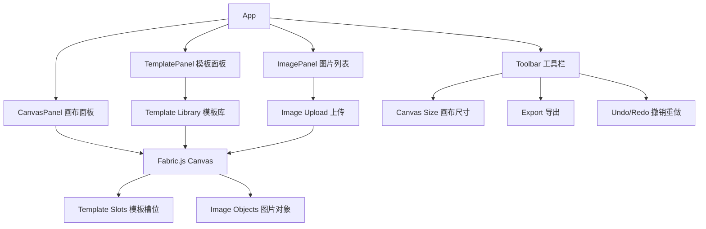

## 产品概述

一个通用的图片排版 Web 工具。用户可以设定任意大小的纸张/画布，上传多张图片，通过预设模板快速排版，并支持微调位置和尺寸，最终导出为 PNG/JPG 图片或 PDF 文件。

## 核心功能

- **画布管理**：支持任意尺寸纸张（预设常用尺寸如 A4/A3/6寸照片等 + 自定义宽高），画布可缩放查看
- **图片上传**：支持拖拽上传和点击上传，支持 JPG/PNG/WebP 格式，多文件批量上传
- **预设排版模板**：提供多种网格布局模板（如 2x2、1大+2小、1+3、横排、竖排等），选中模板后图片自动填入槽位
- **图片微调**：选中模板槽位内的图片后，支持拖拽微调位置、拖拽边角缩放大小、裁剪/填充模式切换
- **导出输出**：支持导出 PNG/JPG（可设置 DPI 和质量），支持导出 PDF（保持纸张原始尺寸和高质量）
- **操作历史**：撤销/重做功能

## 技术栈

- **框架**: React 18 + TypeScript
- **构建工具**: Vite
- **画布引擎**: Fabric.js（开源 Canvas 库，原生支持对象拖拽/缩放/旋转、分组、导出）
- **样式方案**: Tailwind CSS
- **PDF 导出**: jsPDF + html2canvas（或直接利用 Fabric.js 的 toDataURL 配合 jsPDF）
- **状态管理**: Zustand（轻量、简洁，适合中等复杂度应用）
- **拖拽上传**: react-dropzone

## 实现方案

### 核心策略

采用 **Fabric.js Canvas** 作为画布渲染引擎。Fabric.js 原生提供了对象级拖拽、缩放、旋转、分组等能力，天然契合「模板驱动 + 微调」的交互模式。

模板系统采用 **数据驱动** 设计：每个模板定义为槽位配置数组（位置、大小、比例），渲染时在 Fabric.js Canvas 上创建对应的矩形区域作为槽位容器，图片作为 Fabric.Image 对象添加到槽位中并约束在槽位边界内。用户可通过模板选择器一键切换布局，图片自动重新分配到新槽位。

### 关键技术决策

1. **Fabric.js vs 纯 HTML/CSS 定位**：选择 Fabric.js，因为其对象操作 API 完善，导出能力强（toDataURL / toJSON / toSVG），且天然支持高 DPI 渲染，是图片排版工具的理想引擎。
2. **Zustand vs Redux**：选择 Zustand，模板状态、图片列表、画布配置等状态量中等，Zustand 更轻量无模板代码。
3. **导出方案**：Fabric.js Canvas 直接 `toDataURL()` 获取高质量图片，配合 `jsPDF` 生成 PDF，无需中间转换，保证像素精度。

### 性能与可靠性

- 图片上传后创建 `Object URL` 避免重复读取文件
- 画布缩放采用 viewport transform 而非重绘，保持流畅
- 大画布导出时显示进度提示，避免界面假死
- Fabric.js 操作通过 undo/redo stack 实现历史记录

### 架构设计



### 数据流

用户选择模板 → 模板数据(槽位配置) → Fabric.js 渲染槽位矩形 → 用户上传/选择图片 → 图片填入槽位(创建 Fabric.Image 并裁剪约束) → 用户微调(拖拽/缩放) → 导出(Fabric.js toDataURL + jsPDF)

## 目录结构

```
pic-layout/
├── public/
│   └── templates/                  # [NEW] 模板预览缩略图资源
├── src/
│   ├── main.tsx                    # [NEW] 应用入口
│   ├── App.tsx                     # [NEW] 根组件，组合布局
│   ├── types/
│   │   └── index.ts                # [NEW] 核心类型定义（Canvas, Template, ImageItem 等）
│   ├── stores/
│   │   ├── canvasStore.ts          # [NEW] 画布状态（尺寸、缩放、DPI）
│   │   ├── templateStore.ts        # [NEW] 模板状态（当前模板、模板列表）
│   │   ├── imageStore.ts           # [NEW] 图片列表状态
│   │   └── historyStore.ts         # [NEW] 撤销/重做历史栈
│   ├── components/
│   │   ├── CanvasPanel.tsx         # [NEW] 画布主面板，初始化和管理 Fabric.js Canvas
│   │   ├── Toolbar.tsx             # [NEW] 顶部工具栏（画布尺寸、导出、撤销重做）
│   │   ├── TemplatePanel.tsx       # [NEW] 侧边模板选择面板
│   │   ├── ImagePanel.tsx          # [NEW] 侧边图片列表面板（上传+管理）
│   │   ├── TemplateThumbnail.tsx   # [NEW] 单个模板缩略图卡片
│   │   ├── ImageItem.tsx           # [NEW] 单张图片缩略图（拖拽到画布）
│   │   ├── CanvasSizeDialog.tsx    # [NEW] 画布尺寸设置弹窗（预设+自定义）
│   │   └── ExportDialog.tsx        # [NEW] 导出设置弹窗（格式、DPI、质量）
│   ├── hooks/
│   │   ├── useCanvas.ts            # [NEW] Fabric.js Canvas 生命周期管理 hook
│   │   └── useExport.ts            # [NEW] 导出逻辑 hook（PNG/JPG/PDF）
│   ├── services/
│   │   ├── templateService.ts      # [NEW] 模板定义、槽位计算逻辑
│   │   ├── imageService.ts         # [NEW] 图片加载、裁剪、Object URL 管理
│   │   └── exportService.ts        # [NEW] 导出实现（Fabric.js toDataURL + jsPDF）
│   ├── templates/
│   │   └── index.ts                # [NEW] 内置模板配置数据（2x2、1+3 等）
│   └── utils/
│       ├── canvas.ts               # [NEW] Canvas 辅助函数（坐标转换、缩放适配）
│       └── constants.ts            # [NEW] 常量定义（预设尺寸、DPI 默认值等）
├── index.html                      # [NEW] HTML 入口
├── package.json                    # [NEW] 依赖声明
├── tsconfig.json                   # [NEW] TS 配置
├── vite.config.ts                  # [NEW] Vite 配置
├── tailwind.config.js              # [NEW] Tailwind 配置
└── postcss.config.js               # [NEW] PostCSS 配置
```

## 实现注意事项

- Fabric.js Canvas 的 viewport transform 需与缩放控件联动，保持坐标一致性
- 图片填入槽位时采用 `object-fit: cover` 策略（裁剪填充），确保不留白
- 模板切换时保留已上传图片列表，仅重新分配槽位
- 导出时需按照实际纸张尺寸 x DPI 生成高清图片，而非屏幕显示尺寸
- PDF 导出使用 Fabric.js 的 `toDataURL` 后嵌入 jsPDF，确保像素精确

## 设计风格

采用简洁现代的专业工具风格，类似 Figma/Canva 的深色主题编辑器界面。整体布局为三栏结构：左侧模板面板、中间画布区域、右侧图片面板，顶部为工具栏。

## 页面规划

### 页面1: 编辑器主页（唯一核心页面）

**顶部工具栏 (Toolbar)**

- 左侧：Logo + 应用名称
- 中间：画布尺寸选择器（预设尺寸下拉 + 自定义按钮）、缩放控件（放大/缩小/适应窗口）
- 右侧：撤销/重做按钮、导出按钮

**左侧模板面板 (TemplatePanel)**

- 标题 "排版模板"
- 模板网格列表（2列），每个模板显示缩略图预览 + 名称
- 当前选中模板高亮边框
- 模板分类标签（网格、拼接、自由等）

**中间画布区域 (CanvasPanel)**

- 深灰色背景（模拟设计工具画布外区域）
- 画布居中显示，白色背景，带阴影
- 画布内显示模板槽位（虚线边框）和已填充的图片
- 支持滚轮缩放、拖拽平移画布视图
- 底部状态栏显示当前画布尺寸和缩放比例

**右侧图片面板 (ImagePanel)**

- 标题 "图片素材"
- 拖拽上传区域（虚线边框 + 上传图标提示）
- 已上传图片网格列表（缩略图 + 删除按钮）
- 图片可从面板拖拽到画布槽位中
- 点击图片可预览大图

**弹窗：画布尺寸设置 (CanvasSizeDialog)**

- 常用尺寸预设卡片（A4、A3、6寸、4寸、自定义等）
- 宽度和高度输入框（支持 mm/cm/inch/px 单位切换）
- 横竖方向切换
- 确认/取消按钮

**弹窗：导出设置 (ExportDialog)**

- 导出格式选择（PNG / JPG / PDF）
- DPI 设置（72/150/300/自定义）
- JPG 质量滑块（仅 JPG 格式时显示）
- 预估文件大小
- 导出按钮

## Agent Extensions

### Skill

- **writing-plans**
- Purpose: 在需求明确后，将设计方案拆解为详细的分步实施计划，确保开发有序推进
- Expected outcome: 生成包含文件路径、依赖关系、执行顺序的完整实施计划

### SubAgent

- **code-explorer**
- Purpose: 项目初始化后探索生成的代码结构，验证项目配置和依赖安装是否正确
- Expected outcome: 确认项目结构完整、依赖正确、可正常启动