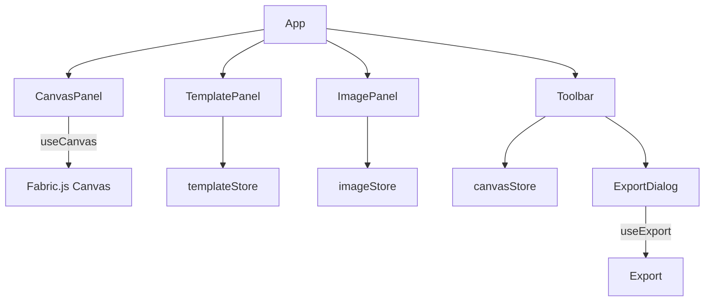

# PicLayout

通用图片排版 Web 工具：设置画布尺寸 → 选择排版模板 → 上传图片 → 槽位内微调 → 导出 PNG/JPG/PDF。

## 功能概览

- **画布尺寸**：内置预设尺寸（纸张/照片/社交）+ 自定义宽高与单位（mm/cm/inch/px），支持背景色与透明背景
- **模板排版**：10 个内置模板（网格/拼接）+ 自定义 N×M 网格（1~10）
- **图片管理**：拖拽/点击上传（JPG/PNG/WebP），图片列表选择与删除，一键自动填入槽位
- **微调交互**：
  - 从右侧图片面板拖拽到画布槽位进行填入
  - 选中画布图片后可在槽位范围内拖动微调
  - 支持把画布中的图片拖动到其它空槽位（自动换槽）
  - 双击画布图片从槽位移除；Delete/Backspace 删除当前选中图片
- **导出输出**：PNG/JPG/PDF，支持 DPI 与 JPG 质量；PNG 支持“透明背景”

## 快速开始

```bash
npm install
npm run dev
```

默认使用 Vite 启动开发服务器，按终端输出的地址访问即可。

## 使用指南

1. **选择画布尺寸**：顶部工具栏点击“画布尺寸”，选择预设或自定义宽高/单位，并可调整背景颜色
2. **选择排版模板**：左侧“排版模板”面板选择内置模板；点击右上角 `+` 可生成自定义网格（列×行）
3. **上传图片**：右侧“图片素材”面板点击或拖拽上传
4. **填入槽位**：
   - 点击“自动填入”把未分配的图片按顺序填入槽位
   - 或将某张图片从右侧拖拽到画布中的槽位
5. **调整显示方式**：选中图片后在右侧选择“裁剪填充 / 完整显示 / 拉伸填充”
6. **微调位置**：在画布内拖动图片进行微调（会自动限制在槽位范围内）
7. **导出**：点击顶部“导出”，选择格式与 DPI（JPG 可调质量，PNG 可选透明背景）

## 导出与 DPI

项目内部以“画布尺寸 + 单位 + DPI”计算最终导出像素尺寸：

- 显示尺寸：基于 96 DPI 将 mm/cm/inch 转为 px 后渲染到画布（用于编辑预览）
- 导出尺寸：在导出时会根据 DPI 将画布临时放大到目标像素大小后再输出，保证打印/高分辨率场景清晰

相关实现位于 [canvasStore.ts](src/stores/canvasStore.ts) 与 [useExport.ts](src/hooks/useExport.ts)。

## 模板说明

内置模板定义在 [templates/index.ts](src/templates/index.ts)：

- 网格：单张、2 张横排、2 张竖排、2×2、3×3、4 张横排
- 拼接：1 大 + 2 小、1 上 + 2 下、1 大 + 3 小、1 上 + 3 下
- 自定义：支持生成 `列×行` 的网格模板（1~10）

自定义模板会保存在浏览器 `localStorage`（key：`custom_templates`）。

## 项目结构

```
pic-layout/
├── src/
│   ├── components/          # 三栏布局 UI + 弹窗
│   ├── hooks/               # Fabric 初始化、导出逻辑
│   ├── stores/              # Zustand 状态（canvas/template/image/history）
│   ├── templates/           # 内置模板 + 自定义网格模板生成
│   ├── types/               # 类型定义
│   ├── utils/               # 常量（预设尺寸、DPI、单位换算等）
│   ├── App.tsx              # 主布局（左模板/中画布/右图片）
│   └── main.tsx             # 入口
└── package.json
```

## 架构速览



核心文件索引：

- 画布渲染与交互： [CanvasPanel.tsx](src/components/CanvasPanel.tsx)
- 模板与自定义网格： [TemplatePanel.tsx](src/components/TemplatePanel.tsx)、[templates/index.ts](src/templates/index.ts)
- 图片上传与填入： [ImagePanel.tsx](src/components/ImagePanel.tsx)、[imageStore.ts](src/stores/imageStore.ts)
- 导出： [ExportDialog.tsx](src/components/ExportDialog.tsx)、[useExport.ts](src/hooks/useExport.ts)

## 开发脚本

```bash
npm run dev      # 开发
npm run build    # 构建（tsc + vite build）
npm run preview  # 本地预览构建产物
npm run lint     # ESLint
npm run desktop:dev    # 桌面端开发（Tauri）
npm run desktop:build  # 桌面端打包（Tauri）
```

## 桌面应用（Tauri）

项目已集成 Tauri 2，可将 Web 编辑器打包成 macOS/Windows/Linux 桌面应用。

环境要求：

- Rust toolchain（rustc / cargo）
- 对应平台的构建依赖（macOS 需要安装 Xcode）

```bash
npm run desktop:dev
npm run desktop:build
```

关键配置：

- Tauri 配置入口： [tauri.conf.json](src-tauri/tauri.conf.json)
- 开发端口：Vite 固定为 `1420`（与 `devUrl` 对齐）

## 技术栈

- React + TypeScript + Vite
- Fabric.js（Canvas 排版与对象交互）
- Zustand（状态管理）
- Tailwind CSS（深色主题 UI）
- jsPDF（PDF 导出）
- react-dropzone（拖拽上传）
- lucide-react（图标）

## 已知限制

- 撤销/重做按钮已提供，但当前版本未绑定画布状态恢复逻辑（见 [historyStore.ts](src/stores/historyStore.ts) 与 [Toolbar.tsx](src/components/Toolbar.tsx)）
